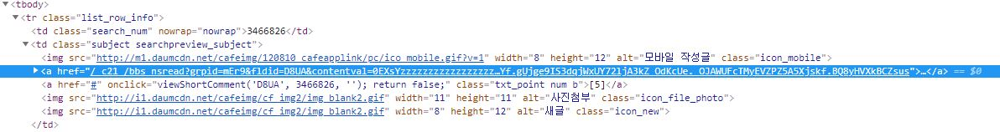

# Crawler
- 다음 Cafe를 크롤링할 예정이다.

## p1 review

### 1. 예상하지 못한 코드
- p1_result.html를 보면 #이 같이 출력된 것을 알 수 있다.
- 웹 페이지 개발자 도구로 살펴보았다.

- 제대로 된 href 밑에 href "#" 때문에 #이 출력된 것이다.
- 조건문으로 #을 지워주자.
- 결과 확인 : p1_result2.html

### 2. 상대 URL
- p2_result2.html를 보면 모두 상대URL로 출력된 것을 알 수 있다.
- 이를 절대 URL로 변환시켜줘야 한다.
- make_links_absolute() 메서드를 사용할 것이다.
- 결과 확인 : p1.result3.html
