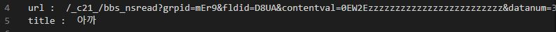

# URL
 - URL, Uniform Resource Locator : 인터넷에 존재하는 리소스의 위치를 나타내는 식별자
 - 크롤러는 웹 페이지에 존재하는 하이퍼링크를 순회한다.
 - 그렇기 때문에 URL에 관한 기초지식이 필요하다.

 ## 1. URL 기초지식
  - 크롤러로 링크를 돌아다니려면 a 태그의 href 속성에서 다른 페이지의 URL을 추출해야 한다.
  - URL이 상대 URL이라면 이를 절대 URL로 변환해야 한다.
  - 상대 URL 예시
  
  - 앞에 cafe의 url이 생략되어 있는 상대 URL 형태이다.

  http://| example.com/| main/index?| q=python| #lead
  -------|-----------|-------|---------|---------
  스키마| 어서리티| 경로| 쿼리| 플래그먼트

  URL 구성요소 | 설명
  ------------| ------------------------------------------------------------------------------
  스키마 | schema, http 또는 https와 같은 프로토콜을 나타낸다.
  어서리티 | authority, // 뒤에 나오는 일반적인 호스트 이름을 나타낸다. 사용자 이름, 비밀번호, 포트 번호도 포함 가능.
  경로 | path, /로 시작하는 해당 호스트 내부에서의 리소스 경로를 나타낸다.
  쿼리 | query, ? 뒤에 나오는 경로와는 다른 방법으로 리소스를 표현하는 방법이다.
  플래그 먼트 | flagment, # 뒤에 나오는 리소스 내부의 특정 부분을 나타낸다.
  
## 상대 URL을 절대 URL로 변환하기
 - urllib.parse 모듈에 있는 urljoin()을 함수를 사용한다.

### urljoin()
 - 첫 번째 매개변수 : 기준이 되는 URL
 - 두 번째 매개변수 : 상대 URL를 지정

~~~py
from urllib.parse import urljoin
base_url = 'http://cafe984.daum.net/_c21_/home?grpid=mEr9'
urljoin(base_url, '/_c21_/bbs_nsread?grpid=mEr9&fldid=D8UA&contentval=0EWlYzzzzzzzzzzzzzzzzzzzzzzzzz&datanum=3462548&searchlist_uri=%2F_c21_%2Fcafesearch&search_ctx=VnKaQtKZsJZB2Q6rEnyTQNJLYJ1BLByrXH6apwnmUgOL5YegifEsd_Js4ckhy1SVXESlL-WdTc6_hxsQpvL-daEQVlnFwnhL1uAZ--BmCZ3_-rVMxOgAcdeRQD3o8.xcQEu9Dvxcf-RIACQ4JB-QWmKGIAI49hehaymW_NVQP8LvAGStx6hP2vk4yD5oGSg3PmSppUGVtE.LINI2RgVzM_sk6TaB9M3FB-Y4pSRWLBthds4w4Mgo-ajYBtkssr3C6cv.-PiObl36QJ897evLLg3tvuM2kVWBAw4uGdX2YeY0')
~~~
