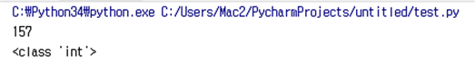
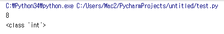
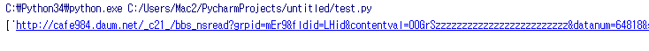
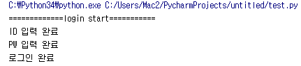

# 1. 입력할 키워드 입력받기
- ※ InputKeyword(self)
- 필요한 라이브러리 : x
~~~py
def InputKeyword(self):
        print("검색할 키워드를 입력하시오 : ")
        self.keyword = input()
~~~

# 2. 검색된 게시물 개수 구하기
- ※ GetSearchCount(self)
- 필요한 라이브러리 : lxml.html, requests, cssselect
~~~py
def GetSearchCount(self):
        session = requests.Session()
        response = session.get(self.searchUrl)    
        root = lxml.html.fromstring(response.content)    root.make_links_absolute(response.url)    
        for txt_point in root.cssselect('tbody > tr > td > div.search_result_box > em'):
            self.searchCount = int(txt_point.text)
~~~

# 3. 최대 페이지 개수 구하기
- ※ GetMaxPageNum(self)
- 필요한 라이브러리 : x
~~~py
def GetMaxPageNum(self):
    self.maxPageNum = int(self.searchCount / 20) # 20은 목록 개수
    if self.searchCount % 20 != 0 : self.maxPageNum += 1
~~~

# 4. 절대주소 리스트에 담기
- ※ SearchAbsoluteUrl(self), Scrape_List_Page(response)
- 필요한 라이브러리 : requests, lxml.html
~~~py
def SearchAbsoluteUrl(self):
    session = requests.Session()    
    for i in range(1,self.maxPageNum+1): # 1부터 maxPageNum까지    
        self.pageNum = i        
        response = session.get(self.searchUrl)        
        urls = self.Scrape_List_Page(response)        
        for url in urls:        
            self.absoluteUrl.append(url)

def Scrape_List_Page(self,response):
    root = lxml.html.fromstring(response.content)    root.make_links_absolute(response.url)
    for a in root.cssselect('tbody > tr > td.subject.searchpreview_subject > a'):    
        if a == '#':   
             continue    
        url = a.get('href')    # yield 구문으로 제너레이터의 요소 반환    
        yield url
~~~

# 5. 로그인하기
- ※ Login(self)
- 필요한 라이브러리 : time, webdriver
~~~py
def Login(self):
    print("=============login start===========")
    self.driver.get(self.loginUrl)    
    time.sleep(self.delay) # delay 초만큼 대기    
    self.driver.find_element_by_id('id').send_keys(self.id)    print("ID 입력 완료")    
    self.driver.find_element_by_id('inputPwd').send_keys(self.pw)  
    print("PW 입력 완료")    
    self.driver.find_element_by_id('inputPwd').submit()    time.sleep(self.delay)    
    print("로그인 완료")
~~~

