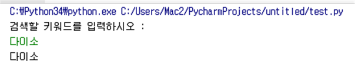

# 1. 입력할 키워드 입력받기
- ※ InputKeyword(self)
- 필요한 라이브러리 : x
~~~py
def InputKeyword(self):
        print("검색할 키워드를 입력하시오 : ")
        self.keyword = input()
~~~

# 2. 검색된 게시물 개수 구하기
- ※ GetSearchCount(self)
- 필요한 라이브러리 : lxml.html, requests, cssselect
~~~py
def GetSearchCount(self):
        session = requests.Session()
        response = session.get(self.searchUrl)    
        root = lxml.html.fromstring(response.content)    root.make_links_absolute(response.url)    
        for txt_point in root.cssselect('tbody > tr > td > div.search_result_box > em'):
            self.searchCount = int(txt_point.text)
~~~

